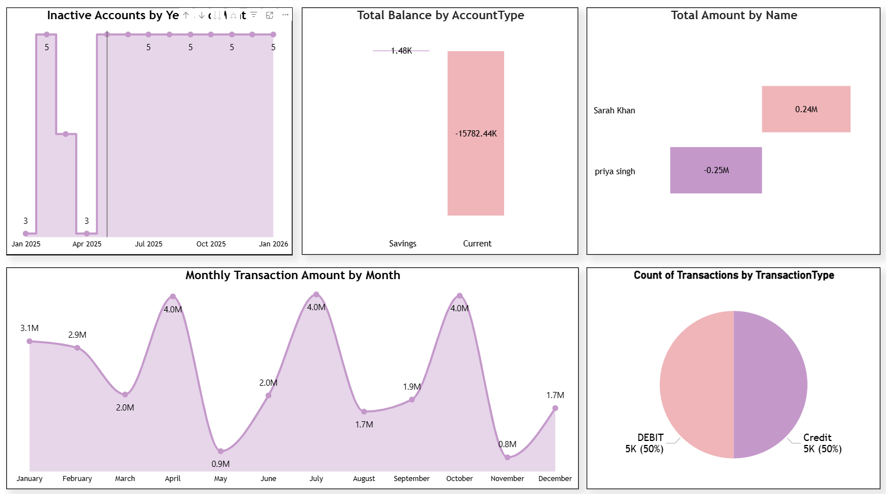
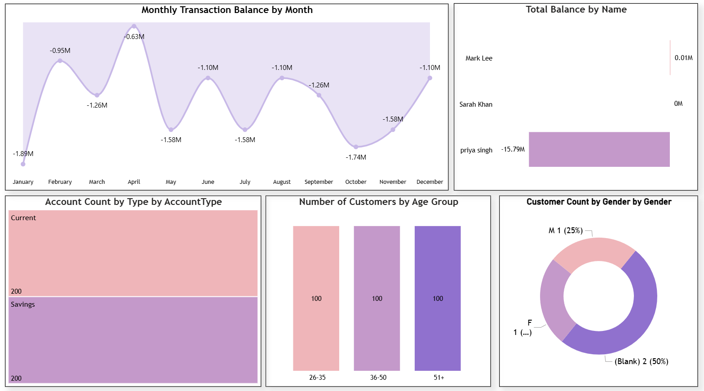

# Banking Transactions Analytics Dashboard (Power BI + SQL Server)

## Project Overview

This project demonstrates an end-to-end Business Intelligence workflow using SQL Server and Power BI.

The objective was to create a banking transaction analytics solution by generating, cleaning, transforming, and visualizing transaction data.

The project includes:

- Synthetic banking dataset generation (10,000+ records)
- SQL Server database creation
- Data cleaning and transformation
- Power Query preprocessing
- Interactive Power BI dashboard creation

---

## Tech Stack

- SQL Server Management Studio (SSMS)
- SQL
- Power BI
- Power Query
- DAX

---

## Dataset

The dataset contains:

### Customers Table
- Customer ID
- Name
- Gender
- Date of Birth
- Contact information

### Accounts Table
- Account Type
- Opening Date
- Balance

### Transactions Table
10,000+ synthetic records including:

- Credits / Debits
- Transaction dates
- Account relationships
- Currency information
- Intentional data quality issues

Examples of introduced issues:

- Duplicate records
- Null values
- Mixed date formats
- Invalid references
- Case inconsistencies
- Outlier transactions

---

## Data Cleaning Process

### SQL Layer

Performed:

✔ Database creation

✔ Table creation

✔ Synthetic transaction generation

✔ Data issue simulation

Examples:

- Invalid Account IDs
- Outlier balances
- Missing descriptions
- Mixed date formats

---

### Power Query Transformations

Inside Power BI:

- Removed duplicates
- Replaced null values
- Standardized date formats
- Corrected datatypes
- Built cleaned combined table

---

## Dashboard Features

Dashboard KPIs include:

- Total Transactions
- Credits vs Debits
- Account Distribution
- Transaction Trends
- Customer Insights
- Balance Analysis

---

### Dashboards




### Power Query Cleaning


### Data Model


---

## SQL Example

```sql
create database Power_BI2

use Power_BI2

-- Drop tables if they exist (order due to FK dependencies)
IF OBJECT_ID('Transactions', 'U') IS NOT NULL DROP TABLE Transactions;
IF OBJECT_ID('Accounts', 'U') IS NOT NULL DROP TABLE Accounts;
IF OBJECT_ID('Customers', 'U') IS NOT NULL DROP TABLE Customers;

-- Customers Table
CREATE TABLE Customers (
    CustomerID     INT PRIMARY KEY,
    Name           NVARCHAR(100),
    Gender         VARCHAR(10) NULL,
    DateOfBirth    VARCHAR(20),          -- to allow mixed formats
    Address        NVARCHAR(200) NULL,
    Email          NVARCHAR(100) NULL,
    Phone          VARCHAR(20),
    AccountID      INT                   -- Not a true FK: dirty data test
);

-- Accounts Table
CREATE TABLE Accounts (
    AccountID   INT PRIMARY KEY,
    CustomerID  INT,                     -- Not a strict FK: allow mismatches
    Type        NVARCHAR(20),
    OpenDate    VARCHAR(20),             -- for mixed formats
    Balance     DECIMAL(18,2)
);

-- Transactions Table
CREATE TABLE Transactions (
    TransactionID    INT,
    AccountID        INT,                -- Can be mismatched for demo
    TransactionDate  VARCHAR(20),        -- Allow mixed formats
    Type             VARCHAR(20),
    Amount           DECIMAL(18,2),
    Description      NVARCHAR(200) NULL,
    Currency         VARCHAR(10),

    -- Not enforcing PK to allow duplicates
);

```

---

## Project Workflow

Dataset Generation

        ↓

SQL Database Creation

        ↓

Data Cleaning

        ↓

Power Query Transformation

        ↓

Power BI Dashboard

        ↓

Reporting & Publishing

